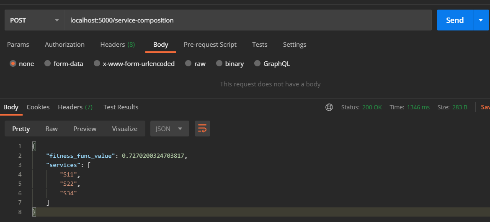
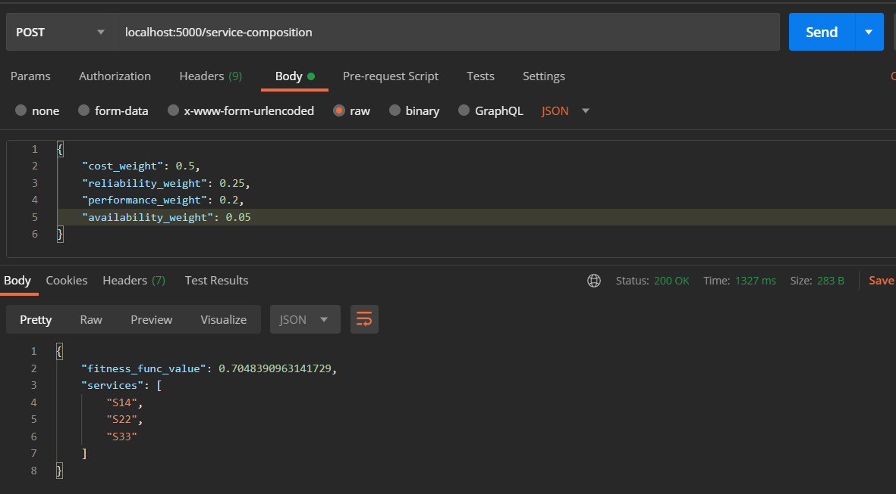

# Lab 4 Note

The files for Lab 4 are in the `GA/` directory. We have provided instructions for running the project
from the command line, and for running it as a web service, as well as for accessing the web
service from our AWS host.

## Running the Command Line Project Locally

Run the command line tool:
```shell
cd GA/
pip install -r requirements.txt   # make sure to use pip for python 3
python3 solve.py  # or python3 solve.py if you have older python versions installed
```

## Running the API Locally

Run the flask app:
```shell
cd GA/
pip install -r requirements.txt
python3 app.py
```

This will run the app on `localhost:5000`

Then, you can make `GET` or `POST` requests to `/service-composition` to build a service 
composition. With the API, you can optionally customize weights for the fitness function:




(Screenshots are in the `web_query_pictures/` directory)

### Web App API Deployment
In the interest of saving you some time grading our project, we have deployed our application to the cloud. 
The application has been deployed to an AWS Elastic Beanstalk instance. 

To test the service using our cloud deployment without needing to install it locally, you can
make the web requests to the following url instead of `localhost:5000`:

http://cs5340team4-env.eba-jmscgv3j.us-east-1.elasticbeanstalk.com/


## Software Engineering Methodology

#### Explanation of fitness function and how it is calculated:
The fitness function is calculated as:
Fitness =  fc * cost_weight + fr * reliability_weight + fp * performance_weight + fa * availability_weight, where the weights represent the importance of cost, reliability, performance, and availability in determining the overall fitness value for a certain service combination.

With our given input file, and specified weights, this equation is:
Fitness = fc * 35% + fr * 10%+ fp * 20% + fa * 35%

The weights can be adjusted if you decide that, for example, more importance should be placed on the cost and less on availability, in which case you might make cost_weight equal to 50% and make availability_weight equal 20%.  The percentiles must always sum to 100%.

With the fitness equation determined, the values of fc, fr, fp, and fa must be determined.

Fc = 1 – (the sum of the cost for each service in the current combination) / (the sum of the cost for the service with the highest cost from each category)

Fp, similarly is calculated as:
Fp = 1 – (the sum of the time for each service in the current combination) / (the sum of the time for the service with the highest time from each category)

To calculate the values fr and fa, the reliability and availability values should be used as decimals. For example, a reliability of 98% would be used in the calculation as 0.98


I have included the diagram for our workflow below:


 
The path taken could be S1 -> S2 -> S3    or    S1 -> S3

To calculate fr, we find fr(s1 -> s3) = fr(s1) * fr(s3)

We also calculate fr(s1 -> s2 -> s3) = fr (s1) * fr(s2) * fr(s3)

We want fr to be the minimum of these two calculated values
Fr = min(fr(s1 -> s3), fr(s1 -> s2 -> s3) ).

We calculate fa in the same way that we calculated fr.

Once we have calculated fc, fr, fp, and fa, we can finally determine the fitness value for a certain combination of services with the equation below: 

Fitness = fc * 0.35 + fr * 0.10 + fp * 0.20 + fa * 0.35

The fitness value should fall in [0,1] and we want to choose the combination of services with the maximum fitness value. As the Genetic Algorithm runs, and more and more epochs are run, the fitness value should converge and w should have a good combination of services to recommend.

#### Explanation of how we built the mapping from business question into the digital world in chromosomes and genes

The business question concerns 3 different service categories with which you must select a service from each category to create a service combination which should be a good overall combination in terms of 4 metrics – cost, reliability, time, and availability. 

To map this into a problem that fits Genetic Algorithm, each chromosome, which represents a combination of services, has 3 genes. One gene corresponds to a service from category 1, a second gene corresponds to a service from category 3, and a third gene corresponds to a service from category 3. The 3 genes are restricted to be integer values, and we further restricted each gene to have a value in the possible range for that category. For example, for category 1, the options are S11 through S15. Hence the gene corresponding to service category 1 can only have a value in [1,5]. 
With the business question mapped into a digital world, the parameters for the genetic algorithm had to be specified. For these parameters, we specified the maximum number of iterations as 100. We set the population size to be 50. This means there are 50 chromosomes in each generation. The mutation probability was set to 10% so that our algorithm did not get stuck in a local maximum instead of a global maximum. 

Our elite ratio was 2%. This means that one elite is kept in the population consistently. The crossover probability we used was 50%. Additionally, the parents_portion was set to 30%. This means that 70% of the population is replaced each time. We used uniform crossover as our crossover type. With uniform crossover, you treat each gene separately. For example, for gene 1, we flip a coin. If we get Heads, the first gene of child 1 is the first gene of parent 1 and the first  gene of child 2 is the first gene of parent 2. On the other hand, if we get Tails, the first gene of child 1 is the first gene of parent 2 and the first gene of child 2 is the first gene of parent 1. 

The fitness function value our genetic algorithm tended to converge to was 0.727… with a service combination of S11, S22, S34

